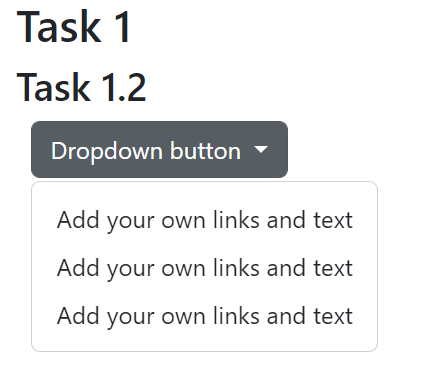
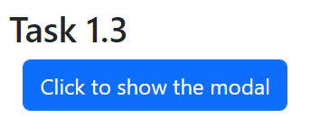
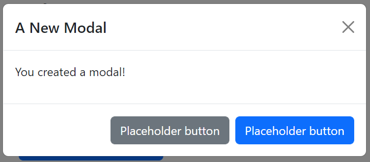

# Task 1 - Bootstrap Dropdowns and Modals

## Task 1.1 - Adding Bootstrap JavaScript

Here's what you need to do:

- You will do everything for this task in the <a href="task1/task1.html">task1.html</a> file.

- Similar to adding the Bootstrap CSS file to your lab in Lab 4 to access all the components, we can add the Bootstrap Javascript library to your website to enable a whole bunch of extra functionality, including dropdowns, alerts, modals, etc. After you add both elements to your file, you will have access to the style and functionality that allows the elements you will create in this lab to work. To add a link to the Bootstrap JavaScript (and CSS file), add the following to the `<head>` of task1.html file using the CDN method:

    - Bootstrap CSS:
        ```
        <link href="https://cdn.jsdelivr.net/npm/bootstrap@5.2.1/dist/css/bootstrap.min.css" rel="stylesheet" integrity="sha384-iYQeCzEYFbKjA/T2uDLTpkwGzCiq6soy8tYaI1GyVh/UjpbCx/TYkiZhlZB6+fzT" crossorigin="anonymous">
        ```
    - Bootstrap JavaScript
        ```
        <script src="https://cdn.jsdelivr.net/npm/bootstrap@5.2.2/dist/js/bootstrap.bundle.min.js" integrity="sha384-OERcA2EqjJCMA+/3y+gxIOqMEjwtxJY7qPCqsdltbNJuaOe923+mo//f6V8Qbsw3" crossorigin="anonymous"></script>
        ```

**Do not forget to add these two elements for all your task files.** If you do not add them, your code will not work. 

## Task 1.2 - Bootstrap Dropdowns Buttons

As you know, the `<button>` tag allows you to create different types of buttons that can help the user interact with your webpage. 

There are different type of buttons that can be added to your websites, such as in the case of dropdown buttons.
For this task, you will be using Bootstrap Dropdown Buttons.
These buttons allow the user to select input from a list of related items.
These inputs can direct to other pages, dynamically change the content in your website, and more.

Here's a link to the <a href="https://getbootstrap.com/docs/5.2/components/dropdowns/">documentation about Bootstrap Dropdown Buttons.</a>

Here's what you need to do for this task:

- Complete everything for this task in the `task1.html` file.

- Create a single dropdown button that contains 3 dropdown options.

Note that the dropdown button might display right next to the edge of the screen. This is normal. However, if you want to fix this, add `style="margin-left: 10px"` as an attribute to the first `<div>` tag.



## Task 1.3 - Bootstrap Modals

Modals are hovering content that show when the user performs an action such as click a button. Modals are commonly used to display a message to the user, remind them of certain information and more depending on your implementation.

You can find the <a href="https://getbootstrap.com/docs/5.2/components/modal/">Bootstrap documentation for Modals through here</a>.

Here's what you need to do for this task:

- Use the `<button>` tag to create a button that triggers the modal you will create.

- Create a modal with a title, a simple line of text as its body content and two placeholder buttons (with no functionality).

Feel free to use the examples from the documentation to create your button and modal. 

Here's roughly what we are expecting of you:





## Specifications

- Display a dropdown button with 3 dropdown options.

- Create a trigger button for the modal.

- Display a modal when the user clicks the trigger button.