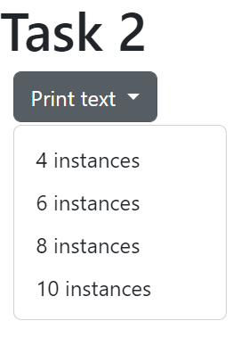
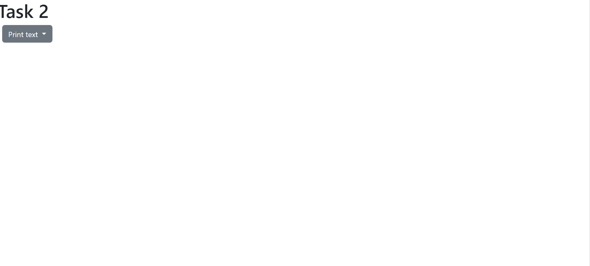

# Task 2 - Buttons and Loops

As seen in the previous task, you can create Bootstrap dropdown buttons. As noted in Task 1, this type of button allows you to provide different input/feedback options for the user, depending on your needs and the type of website you are creating. 

For Task 2, you will make use of a Bootstrap drop down button, as well as loops, to create a program that prints a block of text for a certain amount of times depending on the choice taken by the user.

##  Task 2.1 - Bootstrap Dropdown Button

In Task 1, you created a dropdown button using Bootstrap which displayed 3 choices when the user clicked on it. However, for that task, the buttons directed the user to other websites or webpages depending on the link you provided in the `<a>` tag. 

Depending on your implementation, buttons can be used to perform a variety of different actions. Through the use of different commands, such as `onclick`, you can tell your program what actions to perform and when.

### `onclick` Event

<a href="https://www.w3schools.com/jsref/event_onclick.asp">**onclick**</a> is a JavaScript event (meaning that the program will "listen" for a particular type of user input in order to perform a certain action) that is used to execute JavaScript code when the user clicks on a specific element within the page.

**To tell the computer which action to perform, you need to make the onclick event be equal to the action you want to perform: `onclick="..."`**

For Task 2.1, you will use `onlick` events to execute `printText(times)` (which will print a block of text for a specified number of times in the page) when the user clicks on the dropdown options of the Bootstrap dropdown button.

Here's what you need to do for this task:

- You will everything for this task on the <a href="task2/task2.html">task2.html</a> file.

- Create a Bootstrap dropdown button with 4 dropdown options. 

- Replace the `href=""` attribute by the `onclick` event in each of the dropdown options and add `printText(...)`, replacing the "..." by the number in the dropdown option.

Here's roughly what we are expecting of you:

## Task 2.2 - Printing Text

In Lab7, you were introduced to loops and how they can be used to allow you to repeat a set of actions within your program for a defined number of times. 

Here's what you need to do for this task:

- Inside the `printText(times)`, create a loop that prints a block of text as many times as the user chooses to print.

    - You can use a piece of <a href="https://www.lipsum.com/feed/html">Lorem Ipsum</a> for your block of text.

Here's roughly what we are expecting of you:

- The user chooses to print 8 blocks of code

## Specifications

- Display a dropdown button with 4 options.
 
- Display a block of text as many times as the user chooses from the dropdown options.