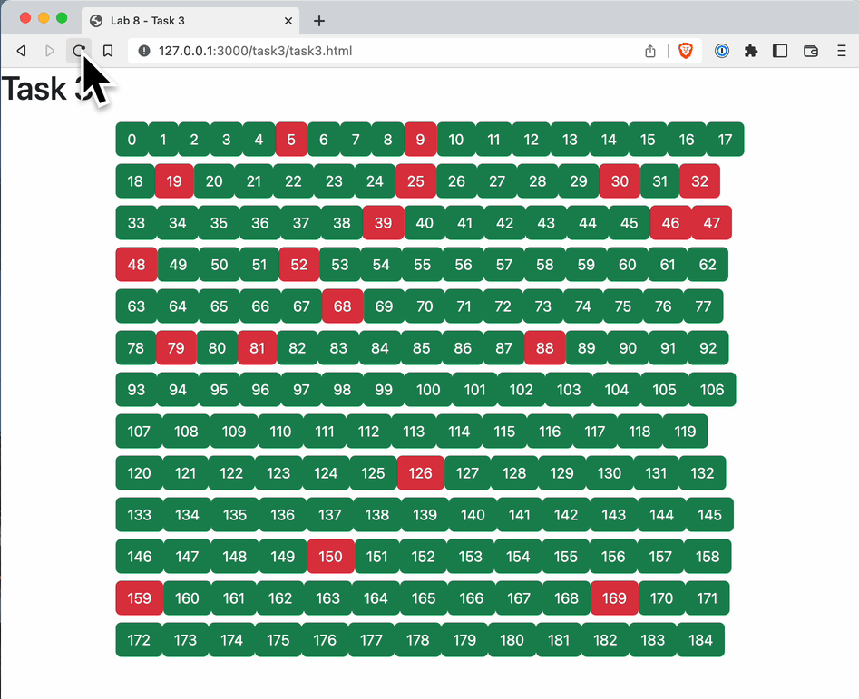

# Task 3 - Arrays, Loops, Conditionals, and Buttons

In this task you will put to use your knowledge of Bootstrap, Arrays, Loops, and Conditionals to create a rectangular array of randomly generated art.

**WARNING: There are a few new things you'll need to learn to complete this task successfully! Based on your knowledge and skills so far, you should be able to piece together how to accomplish the task with the following elements:**

- Generate a random number between 1 and maxNum: `Math.floor(Math.random() * maxNum) + 1`
    - [Documentation here](https://www.w3schools.com/js/js_random.asp)
- `push()` function for Arrays to add numbers at the end of an array:   
    - [Documentation here](https://www.w3schools.com/jsref/jsref_push.asp)
- `numArray.includes(i)` function to determine if `i` is present in `numArray`
    - [Documentation here](https://www.w3schools.com/jsref/jsref_includes_array.asp)
- `Template Literals` using "back-tics" to populate a multi-line string in Javascript using a loop
    - [Documentation here](https://www.w3schools.com/js/js_string_templates.asp)
    - *Hint: unfortunately putting `{i}` in the string literal will not work if you declare a template literal for each of your buttons before the loop - try adding the button with `${i}` inside the `for loop`.*

Here's what you need to do to complete this task:

- You will do everything for this task in the <a href="task3/task3.html">task3.html</a> file.
- All of the code you write should appear within the `<script>` tag we've given you as a template.
- Create an array called `numbers`, and populate it with 20 random numbers between 1 and 185 using an appropriate loop type.
- Create a variable called `buttons`, initialize it to a blank string `""`. 
- Create 185 buttons using a `for` loop and incrementally add the button code to `buttons`.
    - The `buttons` variable will be of type `string` and will contain the code for all your buttons.
    - You will be using a `for` loop and a `string literal` to automatically add a coloured button to `buttons`. 
    - The colour of the button will depend on whether the index variable is in `numbers` (colour 1) or not (colour 2)
    - You are welcome to choose the colours as you like.
- Use `document.write(buttons);` as the last line in `<script>` to display the contents of the `buttons` variable.

Here's roughly what we are expecting of you:

## Specifications

- You **must** use all elements from the list given above (random number generator, `push`, `includes`, and a template literal)

- You **must not** manually create the button by copy pasting the same (or similar) code 185 times.

- Complete the task as outlined above and generate the random art such that every time the page is refreshed, a different pattern appears.