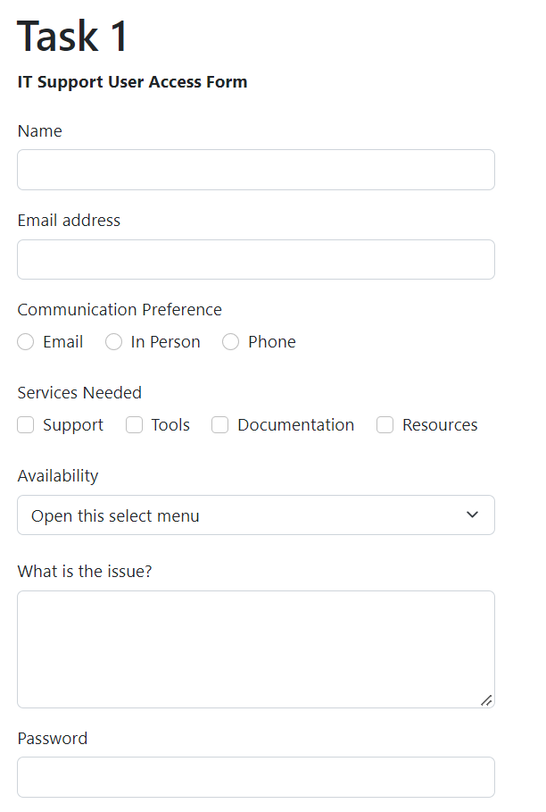
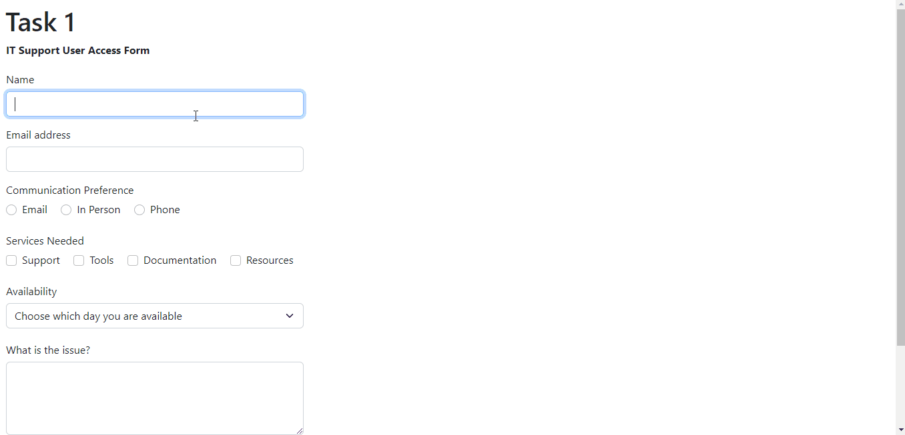

# Task 1 - HTML/Bootstrap Forms and Modals

HTML forms allow users to provide information to the website and developers using a variety of controls such as text boxes, check boxes, dropdowns, radio buttons, customs buttons and more. For this task, you will create a Bootstrap form made up of these elements, as well as a modal that will display the information entered by the user into it.

**Note that the function that prints the form's input into the modal has already been created for you. For this task, you will only create the form and the modal, as well as make some small changes to these so that the program works correctly**

## Task 1.1 - HTML/Bootstrap Form

Last week, you learned about the different HTML's form elements available (input types, lists, text areas, and buttons). Bootstrap's form controls use the basic HTML form elements' syntax while adding additional elements for layout and styling.

The documentation for the different Bootstrap's form elements that you will need to use for this task are provided down below:

- <a href="https://getbootstrap.com/docs/5.2/forms/form-control/">Text inputs and Text Area's documentation here</a>

- <a href="https://getbootstrap.com/docs/5.2/forms/checks-radios/">Checkboxes and radio buttons' documentation here</a>

- <a href="https://getbootstrap.com/docs/5.2/forms/select/">Select menu's documentation here</a>

Here's what you need to do for this task:

- You will do everything for this task in the <a href="task1/task1.html">task1.html</a> file.

- Add an HTML comment before each form element describing what input type it is.

- Add a label for each form element.

    - You will need to add the class `form-label` to the labels. You may need to add break(s) before/after each label.

- Add a <a href="https://www.w3schools.com/tags/att_name.asp">`name` attribute</a> to all form elements. It must specify what form element it belongs to (ex: `name="textInput"`).

- Add a text input and an email input to your form.
    
- Add 3 inline unchecked radio buttons and 4 inline unchecked checkboxes to the form. 

    - Add the value of each checkbox and radio button option to their value attribute.

    - Note that for all radio buttons to be connected to each other, they need to have the same class attribute and name attribute. Same thing for checkboxes.

    - Add two breaks to separate the two form elements.

- Add a select menu with 5 options to your form (excluding the selected one).

    - Note that for the select menu, you will only need to add the name attribute to the `<select>` tag only.

- Add a Text Area to your form with 4 rows.

- Add a password input to your form.

Here's what we are expecting of you:

## Task 1.2 - Bootstrap Modal

Here's what you need to do for this task:

- Add a modal toggle button inside the `<form>...</form>` tag, after all your form elements with the text 'Submit' on it. 

    - When the user clicks on the button, this must activate/call the `printInfo()` method. 

- Add a modal after the form you created. This modal should only have one secondary button that closes the modal.

    - Add the id `modal-title` to the `<h5>` tag in the modal header and erase the content of the tag.

    - Add the id `content` to the `
` tag in the modal body and erase the content of the tag.

## Example Output:

Here's roughly what we are expecting from you (the user input will be different):

## Specifications

- Add a label to all the Bootstrap form elements.

- Use all Bootstrap form elements as outlined above(text, email, password, inline checkboxes, inline radio buttons, and Text Area).

- Create a modal that displays the data submitted by the user, as outlined above.

- When the user clicks the button, the modal must show up, displaying all the data entered/selected by the user.