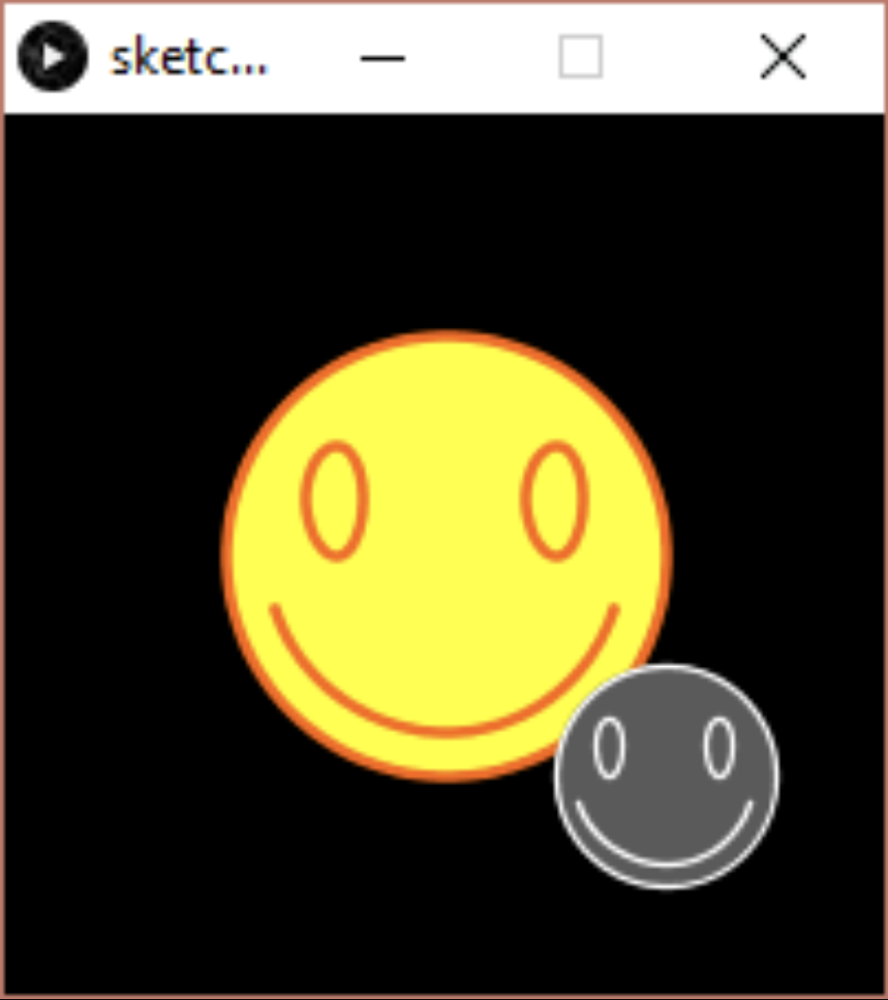

# Task 1 - Add Constructors to HappyFace Class

- Modify your HappyFace class from the last lecture activity so that it has two constructors:
  - A zero-argument constructor that sets the radius to 50, the (x,y) position to (radius,radius), speedX and speedY to 0, fill color to yellow, outline color to orange.
  - A seven-arg constructor that sets the attributes to given values.

## Embed an animated gif of your drawing

Embed the animated gif you created here using markdown syntax: