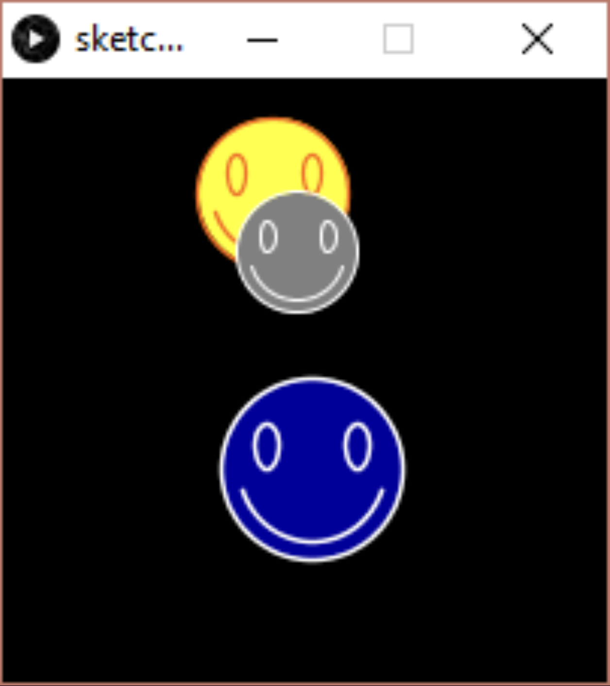

# Task 2 - Bouncing Happy Face(s)

- Create three bouncing happy-faces with different positions, size and speed, and then move, bounce, and display them in the draw() function. 
- Notice how easy it is to create many objects now of the same class and use them in your program.
```
HappyFace f1, f2, f3;

void setup(){
  size(200,200);
  f1 = new HappyFace(...);
  //do the same for f2,f3
}

void draw(){
  background(0);
  f1.move;  f1.bounce(); f1.display();
  //do the same for f2,f3
}

class HappyFace{...}
```


## Embed an animated gif of your drawing

Embed the animated gif you created here using markdown syntax:
