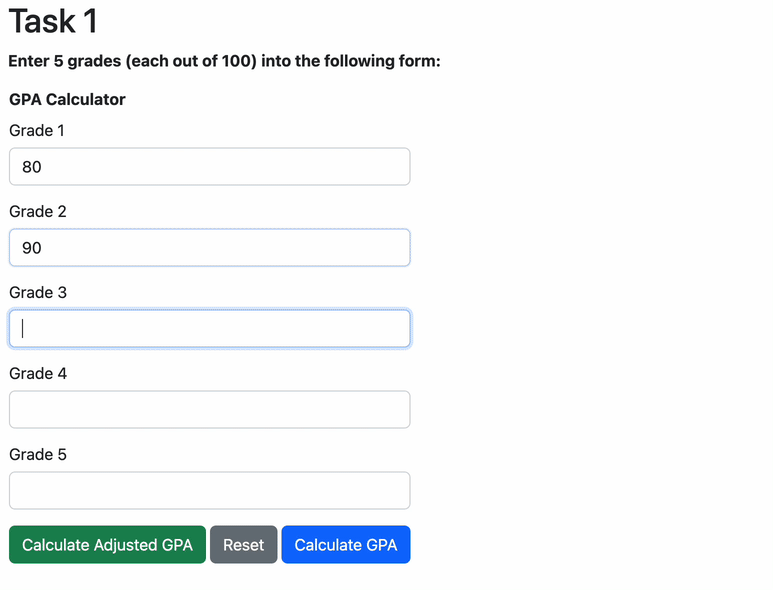

# Task 1 - GPA Calculator

For this lab, you will make use different elements you have learned to use throughout the term in order to create a GPA calculator that takes 5 grades and, upon "submission", calculates the user's final grade and displays the overall average and potential ["letter grade"](https://www.calendar.ubc.ca/okanagan/index.cfm?tree=3,41,90,1014) in a modal.
This is called a **GPA calculator**.

Here's roughly what we are expecting of you:

**Note: there's a bug in the code that generated this gif where the highest grade is dropped instead of the lowest grade! Don't make that error in your lab :-)**

## Specifications 

For this GPA Calculator, here are the specifications:

1. An HTML form using Bootstrap components to collect 5 course grades (from 0-100).
    - Store the grades a user puts in the five input boxes into an array.
1. Add functionality for a "Calculate GPA", and a "Reset" button.
    - The submit button should display a modal to show the final calculated GPA (as a percentage out of 100), as well as the corresponding letter grade.
    - You can look at the [UBCO letter grade](https://www.calendar.ubc.ca/okanagan/index.cfm?tree=3,41,90,1014) for the conversion of percentages to letter grades.
1. Add functionality for a "Calculate Adjusted GPA", which calculates your GPA after dropping your lowest grade.
    - There are several ways to accomplish this. One is to just `Math.min()` function, another way is to sort the array and then use `pop()` to drop the last element.
1. JavaScript code must have *at least one* `if statement` and *at least one* `for loop` that does something useful.
1. Create and use *at least one* JavaScript `function` to take in some parameters and returns a result.

For this lab assignment, **submit your own lab repository on PrairieLearn**.
You are free to look at other web sites for ideas, **do not borrow HTML/JavaScript code from other sites**.