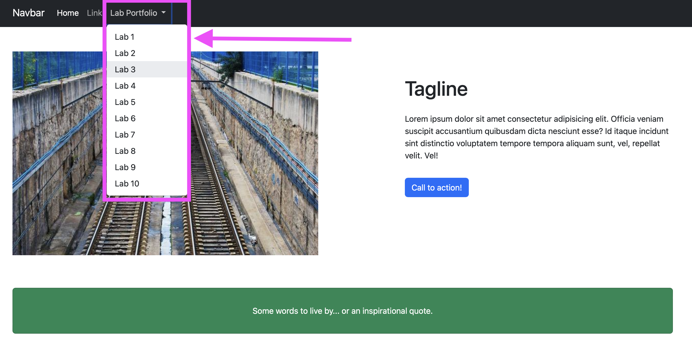

# Task 1

In Task 1, you will start with the website you built in Lab 4, and add a dropdown button in your NavBar linking to a separate page per lab.

Here's what you need to do for this task:

## Specifications

- Add a dropdown button in your NavBar that links to a separate page per lab.
- Your website should be functional, if you click on one of the lab links, it should take you to a new page.